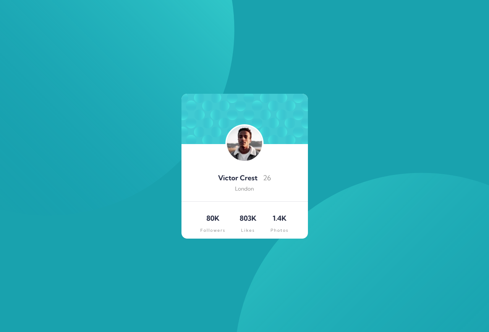

# Frontend Mentor - Profile card component solution

This is a solution to the [Profile card component challenge on Frontend Mentor](https://www.frontendmentor.io/challenges/profile-card-component-cfArpWshJ). Frontend Mentor challenges help you improve your coding skills by building realistic projects. 

## Table of contents

- [Overview](#overview)
  - [The challenge](#the-challenge)
  - [Screenshot](#screenshot)
  - [Links](#links)
- [My process](#my-process)
  - [Built with](#built-with)
  - [What I learned](#what-i-learned)
  - [Continued development](#continued-development)
- [Author](#author)


## Overview

### The challenge

- Build out the project to the designs provided


### Screenshot



### Links

- Solution URL: [Solution URL](https://your-solution-url.com)
- Live Site URL: [Live Site](https://your-live-site-url.com)

## My process

### Built with

- Semantic HTML5 markup
- CSS custom properties
- Flexbox
- CSS Grid
- Mobile-first workflow

### What I learned

I learned you can apply multiple images using url on background image property in CSS.

To see how you can add code snippets, see below:

```css
body {
  background-image: url('/images/bg-pattern-top.svg'), url('/images/bg-pattern-bottom.svg');
}
```


### Continued development

I will definitely continue doing the mobile-first worklflow. Personally, it easier to start mobile-first and you always look at the layout of the desktop and compare the designs that way. Some people do desktop approach which is fine. I find desktop approach much harder than the mobile-first workflow. 


## Author
- Github - [@bccpadge](https://github.com/bccpadge)
- Frontend Mentor - [@bccpadge](https://www.frontendmentor.io/profile/bccpadge)


